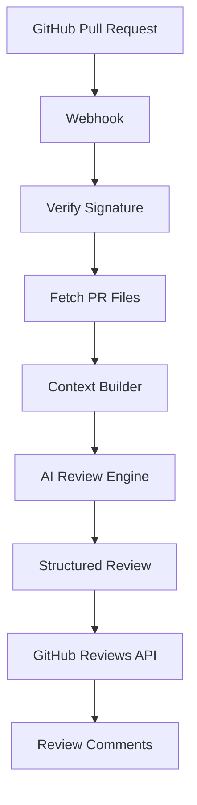

<div align="center">

# 🦊 CodeFox

### AI-powered GitHub Pull Request Reviewer

Review pull requests automatically using AI. CodeFox analyzes code changes, detects bugs, suggests improvements, and posts review comments directly on GitHub.

<p align="center">
  
</p>

<p align="center">
  <a href="#features"><strong>Features</strong></a> •
  <a href="#architecture"><strong>Architecture</strong></a> •
  <a href="#installation"><strong>Installation</strong></a> •
  <a href="#roadmap"><strong>Roadmap</strong></a> •
  <a href="#contributing"><strong>Contributing</strong></a>
</p>

</div>

---

> ⚡ **CodeFox** listens for GitHub Pull Request events, gathers the changed files, sends them to an AI model for review, and automatically posts actionable feedback back to GitHub.
## Why CodeFox?

Code reviews are essential, but they can also be repetitive and time-consuming.

CodeFox helps developers by automatically reviewing pull requests and providing fast, consistent feedback before human reviewers step in.

It can:

- 🔍 Detect bugs
- 🧹 Suggest cleaner code
- 🚀 Recommend performance improvements
- 🔒 Highlight security issues
- 📖 Improve readability
- ✅ Encourage best practices

Think of CodeFox as an AI teammate that reviews every pull request in seconds.
## ✨ Features

- 🤖 AI-powered pull request reviews
- ⚡ GitHub Webhook integration
- 🔐 Webhook signature verification
- 📂 Reviews only changed files
- 💬 Posts review comments directly on GitHub
- 🧠 Context-aware review engine
- 📑 Structured review output
- 🔄 Works with every Pull Request
- 🌐 Easy local development using Cloudflare Tunnel
- 📈 Designed to scale with RAG and MCP support

## 🛠️ Tech Stack

### Backend

- **Bun** – Fast JavaScript runtime and package manager
- **Hono** – Lightweight, high-performance web framework
- **TypeScript** – Type-safe application development

### AI

- **LangChain** – LLM orchestration and prompt management
- **Groq** – High-speed LLM inference
- **Zod** – Structured AI output validation

### GitHub Integration

- **Octokit** – Official GitHub REST API SDK
- **GitHub Webhooks** – Real-time pull request events

### Planned

- **RAG (Retrieval-Augmented Generation)** – Repository-aware code reviews
- **MCP (Model Context Protocol)** – Tool-based contextual reasoning
- **Repository Configuration** – Custom review rules via `.codefox.yml`

## 🎥 Demo

Coming soon.

<!--
Add screenshots or GIFs here.

docs/demo.gif
docs/dashboard.png
-->

## 🚀 How It Works

```text
Developer
     │
     ▼
Push Code
     │
     ▼
Create Pull Request
     │
     ▼
GitHub sends Webhook
     │
     ▼
CodeFox Server
     │
     ▼
Verify Webhook Signature
     │
     ▼
Fetch Changed Files
     │
     ▼
AI Review Engine
     │
     ▼
Generate Suggestions
     │
     ▼
GitHub Review API
     │
     ▼
Review appears inside Pull Request
```
## 🏗 Architecture


