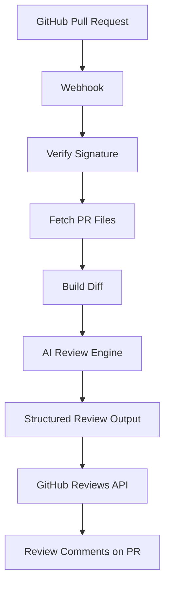

<div align="center">

# 🦊 CodeFox

### AI-powered GitHub Pull Request Reviewer

CodeFox automatically reviews GitHub pull requests using AI — analyzing diffs, catching bugs, flagging security and performance issues, and posting structured feedback directly on GitHub. 

<p align="center">
  
  
  
  
  
</p>

<p align="center">
  
</p>

<p align="center">
  <a href="#features"><strong>Features</strong></a> •
  <a href="#architecture"><strong>Architecture</strong></a> •
  <a href="#roadmap"><strong>Roadmap</strong></a> •
  <a href="#contributing"><strong>Contributing</strong></a>
</p>

</div>

---

## Overview

CodeFox is an AI-powered GitHub pull request reviewer that runs automatically whenever a pull request is opened or updated. It aims to provide fast, actionable, context-aware code reviews while remaining open source and highly extensible.

The project is currently focused on building a strong backend foundation before layering in advanced capabilities like RAG, MCP, and inline review comments.

**How it works, end to end:**

1. Receive a GitHub webhook event.
2. Fetch the changed files from the pull request.
3. Build a clean diff representation.
4. Send the diff to an LLM.
5. Receive a structured review result.
6. Post the AI review back to GitHub.

Future versions will go further — understanding the full repository, its architecture, and its coding conventions using RAG and MCP.

## Features

### GitHub Integration

- Webhook endpoint with signature verification
- Pull request event handling for `opened`, `synchronize`, and `reopened`
- Fetches changed files via the GitHub REST API
- Posts AI review summaries back to the pull request

### AI Review Engine

- LangChain-based AI pipeline
- Groq as the LLM provider
- Structured, validated outputs using Zod
- Consistent, reusable prompt templates
- Detects bugs, security issues, performance problems, maintainability concerns, and general code quality issues

### Review Pipeline

```text
GitHub Webhook
     │
     ▼
Verify Webhook Signature
     │
     ▼
Fetch Pull Request Files
     │
     ▼
Build Review Diff
     │
     ▼
Generate AI Review
     │
     ▼
Publish Review Summary
```

## Architecture



### Project Structure

```text
src/
│
├── ai/
│   ├── client.ts          # LLM client setup
│   ├── prompts.ts         # Prompt templates
│   ├── schema.ts          # Zod schemas for structured output
│   ├── engine.ts          # Review generation logic
│   └── diff-builder.ts    # Builds diff representation from PR files
│
├── github/
│   ├── client.ts           # Octokit client
│   ├── pull-request.ts     # PR data fetching
│   ├── comments.ts         # Posting review comments
│   ├── webhook.ts          # Webhook signature verification
│   └── index.ts
│
├── services/
│   └── review.ts           # Orchestrates the end-to-end review flow
│
├── routes/
│   └── github.ts           # Webhook route handler
│
├── utils/
│
└── index.ts
```

### Design Principles

- Keep modules small and single-purpose.
- Separate AI logic, GitHub integration, and business logic cleanly.
- Prefer structured outputs over parsing raw LLM text.
- Keep the review engine provider-independent, so swapping LLMs is trivial.
- Build reusable services and utilities rather than one-off scripts.
- Design for easy integration of future AI providers.

## Tech Stack

| Layer | Technology |
|---|---|
| Runtime |  |
| Web framework |  |
| Language |  |
| AI orchestration |  |
| LLM provider |  |
| Output validation |  |
| GitHub API |  |
| Events |  |
| Local development |  |

## Roadmap

### Better AI Reviews
- Improved prompt design
- Richer structured outputs
- Confidence scoring per finding
- Severity classification for issues

### GitHub Integration
- Inline review comments on specific lines
- Updating existing comments instead of duplicating them
- GitHub App support
- Review status decisions (approve / request changes)

### Repository Context
- Repository-aware reviews
- Related file retrieval
- README and project context ingestion
- Dependency graph understanding

### Retrieval-Augmented Generation (RAG)
- Local repository indexing
- Embedding-based retrieval
- Semantic search over the codebase
- Relevant code chunk retrieval for review context

### Model Context Protocol (MCP)
- GitHub MCP
- Filesystem MCP
- Documentation MCP
- Database MCP
- Tool-based contextual reasoning

### Scalability
- Chunking for large pull requests
- Retry mechanisms for failed reviews
- Queue-based processing
- Background workers

### Configuration
- Repository-level configuration via `.codefox.yml`
- Ignore rules for files or paths
- Model selection per repository
- Customizable review preferences

## Vision

The long-term vision is an open-source, context-aware AI code reviewer that goes beyond diff analysis.

Rather than reviewing only changed lines, CodeFox aims to understand the entire repository — its architecture, coding standards, documentation, dependencies, and related files — to produce high-quality, human-like reviews.

By combining GitHub integration, Retrieval-Augmented Generation, and the Model Context Protocol, CodeFox is working toward an intelligent review system that reasons over an entire codebase while staying modular, extensible, and developer-friendly.

## Contributing

Contributions are welcome. If you're interested in helping build out RAG support, MCP integrations, or the review engine itself, feel free to open an issue or submit a pull request.

